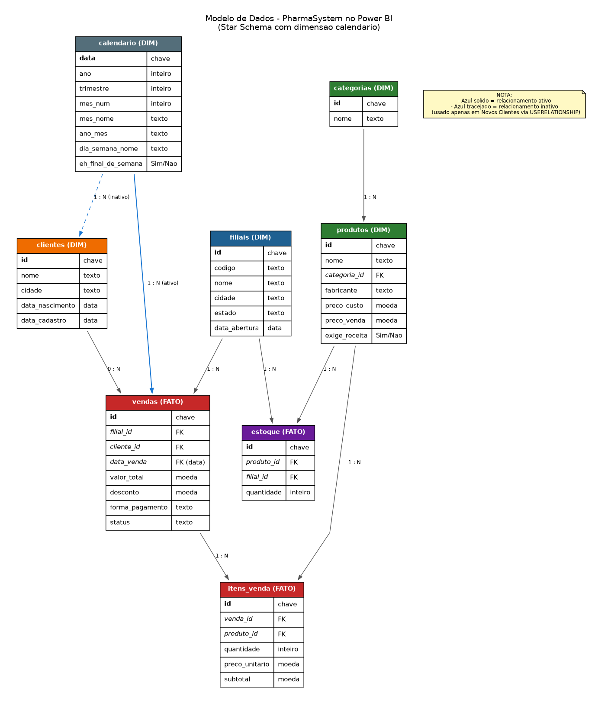

# Módulo 02 — Business Intelligence com Power BI

**PharmaSystem — Semana 2 de 12 do portfólio**

Dashboard executivo interativo da rede fictícia PharmaMinas, construído sobre os dados do Módulo 01 (SQL/PostgreSQL). Três páginas — Visão Geral, Produtos e Clientes — com 32 medidas DAX, modelo Star Schema, tema visual customizado e mais de 20 visuais.

---

## Prévia visual

Abra em `docs/`:
- `mockup_pagina1_visao_geral.png` — KPIs financeiros, evolução mensal, top filiais
- `mockup_pagina2_produtos.png` — campeão do período, top 10 produtos, categorias, alertas
- `mockup_pagina3_clientes.png` — LTV, segmentação etária, geografia, retenção

---

## Contexto no PharmaSystem

Os dados existem no banco (Módulo 01), mas a diretoria da rede precisa de **visibilidade rápida**. Este módulo transforma dados brutos em um dashboard executivo interativo — o tipo de entregável que analistas de dados produzem no dia a dia em farmácias, redes de varejo e empresas de saúde.

**Perguntas que o dashboard responde:**
- Como está o faturamento vs. mês anterior e ano anterior?
- Quais filiais estão performando melhor?
- Qual o produto campeão do mês?
- Qual a concentração de faturamento no top 10?
- Quantos clientes ativos temos?
- Qual o LTV médio?
- Onde estão nossos clientes geograficamente?

---

## O que este pacote entrega

Este pacote **NÃO contém o `.pbix` pronto** — ele foi gerado em ambiente Linux, e Power BI Desktop só existe para Windows. Em vez disso, entrega tudo que você precisa para construir o `.pbix` no seu computador em ~8 horas, seguindo o guia de reversa.

```
modulo-02-powerbi-pharma-system/
├── README.md                              (este arquivo)
├── COMO_ESTUDAR.md                        (roteiro de engenharia reversa)
├── dados/
│   ├── filiais.csv                        15 filiais MG
│   ├── categorias.csv                     10 categorias
│   ├── produtos.csv                       71 produtos
│   ├── estoque.csv                        1.065 registros
│   ├── clientes.csv                       200 clientes
│   ├── vendas.csv                         1.500 vendas
│   ├── itens_venda.csv                    3.253 itens
│   └── calendario.csv                     912 linhas (2024-01 a 2026-06)
├── dax/
│   ├── 01_medidas_base.dax                13 medidas
│   ├── 02_medidas_temporais.dax           8 medidas (Time Intelligence)
│   ├── 03_medidas_avancadas.dax           11 medidas (Rankings, TopN)
│   └── README.md                          Explicação das 32 medidas
├── docs/
│   ├── modelo_dados.png / .dot            Star Schema visual
│   ├── mockup_pagina1_visao_geral.png     Mockup da página 1
│   ├── mockup_pagina2_produtos.png        Mockup da página 2
│   ├── mockup_pagina3_clientes.png        Mockup da página 3
│   ├── mockup_pagina*.svg                 Versões SVG editáveis
│   ├── especificacao_visuais.md           Detalhes técnicos dos visuais
│   └── guia_construcao.md                 Passo a passo (9 fases)
├── scripts/
│   └── extrair_dados_csv.py               Regera os CSVs do Módulo 01
└── tema/
    └── tema_pharmasystem.json             Tema visual do Power BI
```

---

## Como usar

### Opção 1 — Estudo por engenharia reversa (recomendado)
Siga o roteiro em `COMO_ESTUDAR.md`. São 7 dias de estudo com carga diária de 1-2 horas, terminando com seu próprio `.pbix` completo.

### Opção 2 — Construção direta
Se já conhece Power BI e quer só implementar:
1. Instale o **Power BI Desktop** (Windows, grátis).
2. Abra `docs/guia_construcao.md` e siga as **9 fases** em sequência.
3. Tempo estimado: 8 a 10 horas de trabalho efetivo.

---

## Modelo de dados



**Dimensões** (contexto): `calendario`, `filiais`, `clientes`, `produtos`, `categorias`
**Fatos** (medidas): `vendas`, `itens_venda`, `estoque`

- 8 relacionamentos ativos + 1 inativo (para `Novos Clientes` via `USERELATIONSHIP`)
- `calendario` marcada como Tabela de Data
- Star Schema clássico (dimensões conectam ao fato via chaves)

---

## Volumetria do dataset

| Métrica | Valor |
|---|---|
| Filiais | 15 (Montes Claros, BH, Uberlândia, Janaúba, Diamantina, Salinas, etc.) |
| Categorias | 10 |
| Produtos | 71 SKUs ativos |
| Clientes | 200 |
| Vendas | 1.500 transações |
| Itens de venda | 3.253 |
| Faturamento total | R$ 224.418,17 |
| Período coberto | Jan/2024 a Jun/2026 (912 dias) |

Todos os dados são **sintéticos e reproduzíveis** (seed=42 no gerador do Módulo 01).

---

## As 32 medidas DAX

**Base (13):** Faturamento Total, Faturamento Bruto, Total Descontos, Total Vendas, Vendas Canceladas, Ticket Médio, Itens Vendidos, Total Clientes, Clientes com Compra, Produtos Ativos, Taxa Cancelamento, Margem Bruta, % Margem.

**Time Intelligence (8):** Faturamento Mês Anterior, Ano Anterior, Crescimento MoM %, YoY %, YTD, YTD Ano Anterior, Média Móvel 3M, Clientes Ativos 90d.

**Avançadas (11):** Ranking Filial, Ranking Produto, % do Total, Faturamento Top 10, Concentração Top 10 %, Produto Mais Vendido, Filial Mais Vendedora, Ticket Médio da Rede, Ticket vs Rede %, Novos Clientes (USERELATIONSHIP), Rótulo Faturamento (SWITCH+FORMAT).

Ver detalhamento completo em `dax/README.md`.

---

## Paleta de cores

| Uso | Hex |
|---|---|
| Verde farmácia primário | `#00695C` |
| Verde farmácia secundário | `#26A69A` |
| Azul confiança | `#1976D2` |
| Âmbar destaque | `#FFA000` |
| Roxo clientes | `#7B1FA2` |
| Verde OK | `#4CAF50` |
| Vermelho warning | `#EF5350` |
| Cinza fundo | `#F5F5F5` |
| Cinza texto | `#424242` |

O tema `tema/tema_pharmasystem.json` já aplica tudo automaticamente. Importe em **Exibição → Temas → Procurar temas**.

---

## Regenerando os CSVs

Se você alterou o Módulo 01 (novos dados, mais filiais, etc.), regere os CSVs:

```bash
cd modulo-02-powerbi-pharma-system
python scripts/extrair_dados_csv.py
```

O script lê o schema e inserts do Módulo 01 (deve estar na pasta irmã `modulo-01-sql-pharma-system/`), roda em SQLite em memória e exporta cada tabela + tabela calendário.

---

## Publicação no GitHub

Estrutura sugerida no repositório `pharma-system`:

```
pharma-system/
├── modulo-01-sql/          ← Módulo 01 (Semana 1)
└── modulo-02-powerbi/      ← este módulo
    ├── README.md
    ├── PharmaSystem.pbix   ← você gera este
    ├── dados/
    ├── dax/
    ├── docs/
    │   ├── prints/         ← screenshots do seu .pbix
    │   ├── *.md
    │   └── modelo_dados.png
    ├── scripts/
    └── tema/
```

---

## Post do LinkedIn — Rascunho

> 🎯 Semana 2 do meu portfólio de Engenharia de Sistemas concluída!
>
> Construí um dashboard executivo em Power BI para a rede fictícia PharmaMinas, cobrindo Visão Geral, Produtos e Clientes.
>
> Highlights:
> ✅ Star Schema com 5 dimensões e 3 fatos
> ✅ 32 medidas DAX (base, time intelligence e avançadas)
> ✅ Tema visual customizado
> ✅ USERELATIONSHIP para relacionamento inativo
> ✅ Rankings dinâmicos com RANKX
> ✅ Análise de concentração top 10 (regra 80/20)
>
> Dados sintéticos de 15 filiais em MG, 1.500 vendas e R$ 224 mil de faturamento simulado — tudo reproduzível.
>
> #PowerBI #Dashboard #DataAnalytics #BusinessIntelligence #DAX #PortfolioDev #EngenhariaDeSistemas

Anexe os 3 prints das páginas do seu `.pbix` no post.

---

## Próximos módulos do portfólio

- **Módulo 03** — Análise com Python/Pandas (dashboards em Streamlit)
- **Módulo 04** — Pipeline ETL automatizado
- **Módulo 05** — API REST
- ...

Ver plano completo em `apostila-portfolio-12-semanas.md`.

---

## Créditos

- **Autor:** Lucas Veríssimo (UNIMONTES — Engenharia de Sistemas)
- **Dataset:** PharmaSystem (Módulo 01), gerado sinteticamente com seed=42
- **Assistência técnica:** Claude (Anthropic)
- **Ferramenta alvo:** Power BI Desktop 2.x (Windows)
