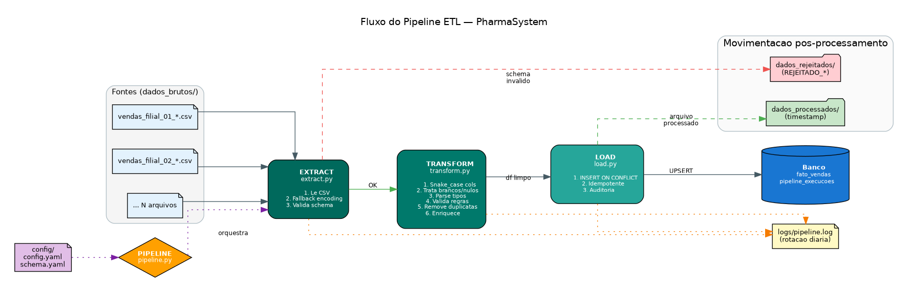

# Arquitetura do Pipeline ETL

## Visão Geral

Este pipeline implementa o padrão **Extract → Transform → Load** clássico, otimizado para o cenário real de uma rede de farmácias que recebe CSVs de vendas diariamente das filiais.



---

## Princípios de Design

### 1. Idempotência

Rodar o pipeline **N vezes** com os mesmos arquivos produz o mesmo estado final no banco. Nada é duplicado.

**Como é garantido:**
- Chave natural: `(filial_codigo, data_venda, cliente_cpf, produto_codigo)`
- `UNIQUE CONSTRAINT` no banco força unicidade
- `INSERT ... ON CONFLICT DO UPDATE` (UPSERT) atualiza em vez de duplicar
- CPF nulo tratado como `SEM_CPF` (evita `NULL != NULL` do SQL)

**Prova empírica:** ver `log_execucao_2_idempotencia.txt` — segunda execução com mesmos dados: 0 inseridas, 170 atualizadas.

### 2. Separação de Responsabilidades

Cada módulo tem uma responsabilidade única:

| Módulo | O que faz | O que NÃO faz |
|---|---|---|
| `extract.py` | Lê arquivo, valida schema | Não transforma dados |
| `transform.py` | Limpa, valida, enriquece | Não lê nem escreve arquivos |
| `load.py` | Escreve no banco | Não transforma dados |
| `pipeline.py` | Orquestra E→T→L | Não implementa lógica de E, T ou L |
| `config.py` | Carrega YAML | Não decide política |
| `logger.py` | Configura logging | Não define mensagens |

Essa separação permite trocar peças isoladamente. Exemplo: trocar SQLite por PostgreSQL só afeta `load.py`.

### 3. Fail-Loud + Fail-Safe

- **Fail-Loud:** todo erro é logado com contexto (`arquivo`, `motivo`, `stack trace`).
- **Fail-Safe:** um arquivo com erro não derruba o pipeline inteiro. Ele é movido para `dados_rejeitados/` com prefixo `REJEITADO_` ou `ERRO_TRANSFORM_` / `ERRO_LOAD_`.

Configurável em `config.yaml`:
```yaml
pipeline:
  em_caso_de_erro: continuar  # ou "abortar"
```

### 4. Auditoria Completa

Toda execução deixa rastros:

- **Logs em arquivo:** `logs/pipeline.log` com timestamp, nível, módulo, mensagem.
- **Rotação:** diária, mantendo 30 dias.
- **Metadados no banco:** tabela `pipeline_execucoes` armazena estatísticas de cada run.
- **Metadados por linha:** cada linha de `fato_vendas` tem `origem_arquivo`, `inserido_em`, `atualizado_em`.

### 5. Configuração Externa

Nada de valores mágicos no código. Tudo em YAML:

- **`config.yaml`** — caminhos, backend do banco, regras de negócio, formatos de data aceitos.
- **`schema.yaml`** — colunas obrigatórias/opcionais, tipos, valores aceitos.

Consequência: para adicionar uma nova regra de validação, edita YAML — não código.

---

## Fluxo Detalhado

### Etapa 1 — Extract

```
para cada arquivo em dados_brutos/vendas_filial_*.csv:
    1. Verifica se arquivo existe e tem tamanho > 0
    2. Tenta ler com UTF-8-BOM → Latin-1 → CP1252 (fallback progressivo)
    3. Valida schema: colunas obrigatórias presentes?
       - Se SIM → passa adiante
       - Se NÃO → marca como REJEITADO com motivo
```

**Sinais de sucesso no log:**
```
INFO | extract | [vendas_filial_01_*.csv] Lido: 30 linhas, 10 colunas, encoding=utf-8-sig
```

**Sinais de rejeição:**
```
ERROR | extract | [vendas_filial_04_*.csv] Schema invalido: colunas obrigatorias faltando: quantidade
WARNING | extract | [vendas_filial_05_*.csv] CSV sem dados
```

### Etapa 2 — Transform

Aplicada apenas em arquivos que passaram no Extract.

Pipeline linear de transformações:

```
padronizar_colunas    → snake_case
remover_linhas_brancas → linhas totalmente vazias
converter_tipos       → datas (multi-formato), decimais (BR ou US), ints
validar_regras_negocio:
    - quantidade > 0
    - preço > 0
    - forma_pagamento ∈ {PIX, DINHEIRO, DEBITO, CREDITO, CONVENIO}
    - data no intervalo [2020, 2030]
    - obrigatórias não-nulas
remover_duplicatas    → por chave natural (mantém primeira)
enriquecer            → valor_total, ano_mes, CPF só dígitos
```

Retorna DataFrame limpo + `RelatorioTransform` com contagens por causa de remoção.

### Etapa 3 — Load

```sql
INSERT INTO fato_vendas (colunas...)
VALUES (?, ?, ...)
ON CONFLICT (filial_codigo, data_venda, cliente_cpf, produto_codigo)
DO UPDATE SET
    coluna_A = excluded.coluna_A,
    coluna_B = excluded.coluna_B,
    ...
    atualizado_em = CURRENT_TIMESTAMP;
```

**Diferença entre INSERT e UPDATE** é medida por `COUNT(*)` antes/depois, o que é preciso para SQLite.

---

## Esquema do Banco

### Tabela `fato_vendas`

```sql
CREATE TABLE fato_vendas (
    id                INTEGER PRIMARY KEY AUTOINCREMENT,
    filial_codigo     TEXT     NOT NULL,
    data_venda        TEXT     NOT NULL,
    cliente_cpf       TEXT,
    produto_codigo    TEXT     NOT NULL,
    produto_nome      TEXT     NOT NULL,
    quantidade        INTEGER  NOT NULL CHECK (quantidade > 0),
    preco_unitario    REAL     NOT NULL CHECK (preco_unitario > 0),
    desconto          REAL     NOT NULL DEFAULT 0,
    valor_total       REAL     NOT NULL,
    forma_pagamento   TEXT     NOT NULL,
    vendedor          TEXT,
    ano_mes           TEXT     NOT NULL,
    origem_arquivo    TEXT     NOT NULL,
    inserido_em       TEXT     NOT NULL DEFAULT CURRENT_TIMESTAMP,
    atualizado_em     TEXT,
    UNIQUE (filial_codigo, data_venda, cliente_cpf, produto_codigo)
);
```

### Tabela `pipeline_execucoes` (auditoria)

Uma linha por execução do pipeline com estatísticas agregadas.

---

## Trocando SQLite por PostgreSQL

O código está preparado. Passos:

1. Instalar driver:
   ```bash
   pip install psycopg2-binary
   ```

2. Editar `config/config.yaml`:
   ```yaml
   banco:
     backend: postgres
     postgres:
       host: localhost
       port: 5432
       database: pharma_dw
       user: pharma_etl
       password: ${PHARMA_DB_PASSWORD}  # variavel de ambiente
   ```

3. Definir a senha antes de rodar:
   ```bash
   export PHARMA_DB_PASSWORD='sua_senha'
   ```

4. Implementar `CarregadorPostgres` em `src/load.py` (esqueleto comentado ao final do arquivo).

A sintaxe `INSERT ... ON CONFLICT` é **idêntica** entre SQLite 3.24+ e PostgreSQL 9.5+ — o migration é praticamente indolor.

---

## Rodando em Produção

### Agendamento

**Linux/Mac (cron):** rodar a cada 30 minutos
```cron
*/30 * * * * cd /caminho/pharma-etl && /usr/bin/python3 scripts/executar_pipeline.py >> logs/cron.log 2>&1
```

**Windows (Task Scheduler):** criar tarefa que dispara `scripts/executar_pipeline.py`.

**Docker (produção real):** `docker-compose` com serviço `etl` rodando `sleep 1800 && python scripts/executar_pipeline.py` em loop.

### Monitoramento

Alertar quando:

- `status == "FALHA"` em qualquer execução
- `arquivos_rejeitados > 30%` do total
- Tempo de execução aumenta 3× a média

Consulta útil na tabela de auditoria:

```sql
SELECT
    DATE(executado_em) AS dia,
    COUNT(*) AS execucoes,
    SUM(linhas_inseridas) AS inseridas,
    SUM(arquivos_rejeitados) AS rejeitados,
    AVG(duracao_segundos) AS tempo_medio,
    MAX(duracao_segundos) AS tempo_max
FROM pipeline_execucoes
WHERE executado_em >= DATE('now', '-30 days')
GROUP BY dia
ORDER BY dia DESC;
```

---

## Extensões Naturais

Este pipeline é uma **base**. Extensões possíveis:

1. **Dimensões auxiliares:** carregar `dim_filiais`, `dim_produtos`, `dim_clientes` a partir de outros CSVs.
2. **Star Schema completo:** transformar `fato_vendas` denormalizada em modelo estrela.
3. **Envio de e-mail:** ao final do pipeline, mandar resumo por email (`smtplib` da biblioteca padrão).
4. **Retry automático:** para falhas transitórias de rede (`tenacity` library).
5. **Paralelismo:** processar N arquivos em paralelo com `concurrent.futures` (útil quando N > 100).
6. **Data Lake:** salvar CSVs raw em S3/GCS antes de processar, para replay futuro.
7. **Streaming:** trocar CSVs por Kafka/Kinesis para latência menor.
